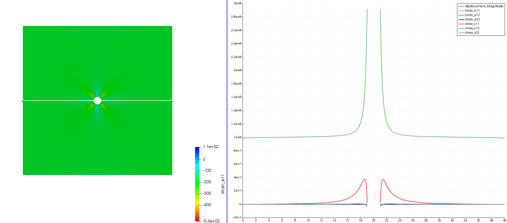

# Project Extra
This code was written to extend the functionality of the basic FEM code developed for the project. The additions are:
1. Complex mesh generation: msh_to_inp.py can convert .msh file from GMSH to the input .txt file. Be careful, the input.txt file needs new line spaces after BOUNDARY to be read. 
2. Boundary Conditions: Hard coded body force in fem2d.m, hardcoded traction and dirichlet boundary in fem2d.m so that i can apply boundary at arbitrary locations using coordinates criteria. Dummy boundary have to be present in input.txt to work tho. inputreader.p is execute only code which is why I had to use this workaround.
3. Visualisation: To visualise I am exporting the displacement, stresses and strains to .vtk using writevtkall.m, which can be read using paraview. Visualising in matlab (visualizeResults.m) is a drag.

